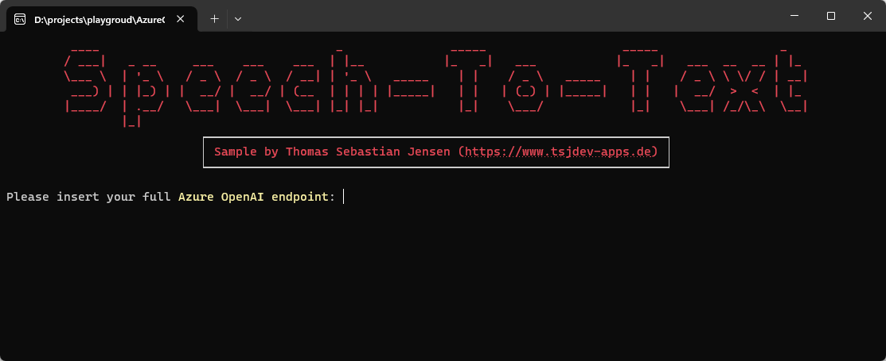
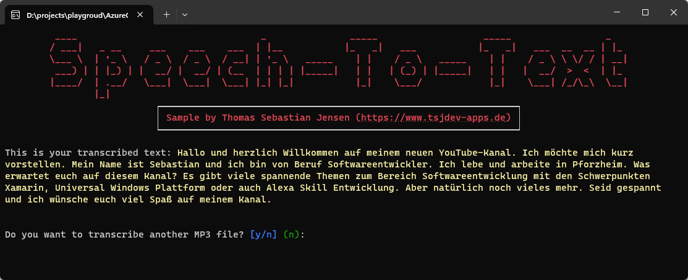
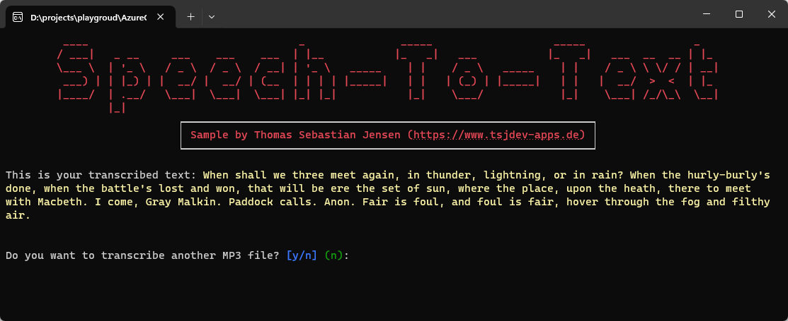

# Speech-To-Text wit Azure OpenAI and the Whisper Model

This repository contains a simple console application written in .NET 8 to demonstrate how to use the [Whisper Model by Microsoft](https://learn.microsoft.com/en-us/azure/ai-services/openai/concepts/models#whisper-models-preview) to transcribe any MP3 file.

## Usage

You need to have an active Azure Subscription. Currently you need to request access to the Azure OpenAI Services. You need to fill the [request form](https://customervoice.microsoft.com/Pages/ResponsePage.aspx?id=v4j5cvGGr0GRqy180BHbR7en2Ais5pxKtso_Pz4b1_xUNTZBNzRKNlVQSFhZMU9aV09EVzYxWFdORCQlQCN0PWcu) from Microsoft, just answer different questions and give Microsoft some time to accept your request.

Add a deployment of the Whisper model. Currently the Whisper model is only available in North Central US or West Europe, so make sure that your Microsoft OpenAI Account is in one of these regions.

Copy the *endpoint* and the *key* and the *deployment name of the Whisper deployment*.

## Screenshots

Here you can see the console application in action:

## Blog Post

If you are more interested into details, please see the following [medium.com](https://www.medium.com) post:

- [Use Azure OpenAI to get a transcript of any MP3 file using C#](https://medium.com/medialesson/use-azure-openai-to-get-a-transcript-of-any-mp3-file-using-c-70df15a282ca)
